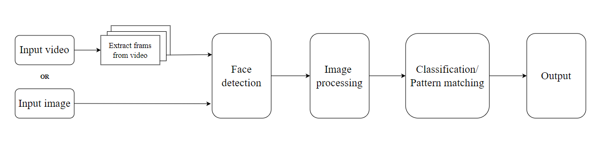
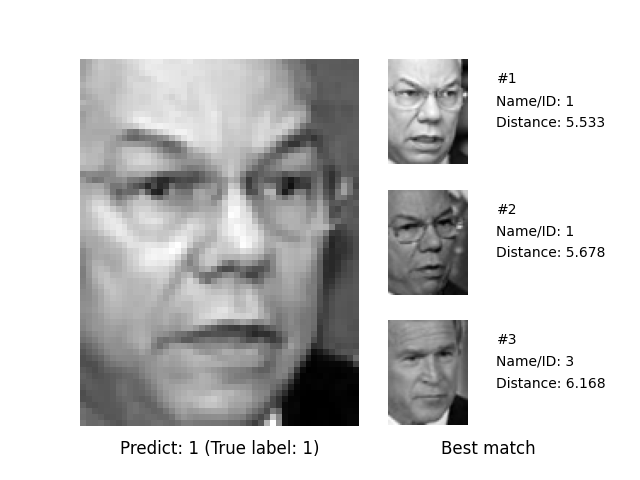

# Face Recognition 
In this research, we performed multiple experiments on face recognition, utilizing diverse methods such as different kinds of Principal Component Analysis (PCA), distance measures, machine learning classifiers, and image enhancement techniques. Our findings indicated that Logistic Regression and Support Vector Machines outperformed other techniques in analyzing the AT&T dataset. Moreover, Modular PCA displayed notable effectiveness with the LFW dataset. Additionally, our observations highlighted the substantial improvement in recognition scores through image enhancement techniques compared to the original dataset.

## Pipeline 

## Installation

To use this project locally, follow these steps:

1. Clone the repository: `git clone https://github.com/lilistac/face-recognition.git`
2. Install the required dependencies: `pip install -r requirements.txt`

## Demo 
Within the face recognition system, the algorithm searches for the identity in the input image or frames of a (real-time) video within the database. This process utilizes machine learning classifiers and can generate a list of the most accurate matches based on distance measures.

